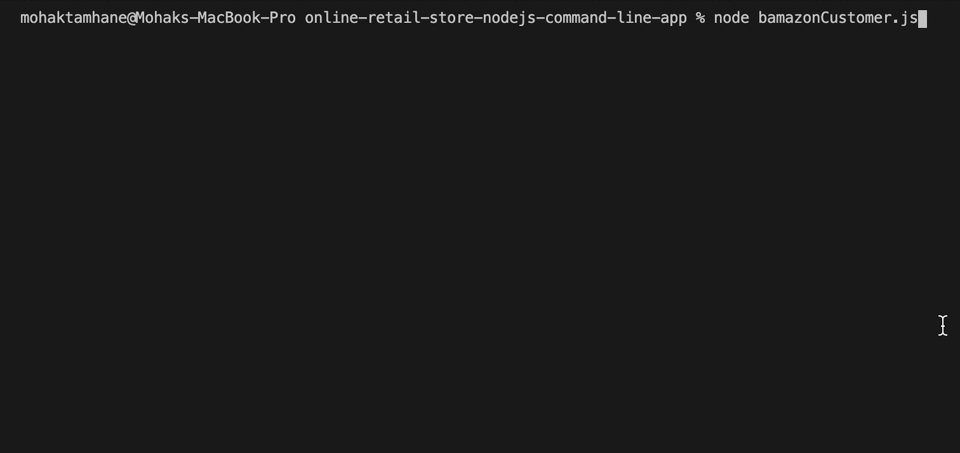

# Online Retail Store

A Node.js command line Amazon-like storefront with the MySQL for database.
Performs all CRUD operations. The app will take in orders from customers and deplete stock from the store's inventory.

## Installation
Run the retailStoreDB.sql to seed data into your MySQL database.

Configure your connection setting in the .js files for your MySQL database.
```js
const connection = mysql.createConnection({
    host: "localhost", //DB location
    port: 3306, //Port number
    user: "root", //MySQL Database username
    password: "YOUR_MySQL_PASSWORD_GOES_HERE", //Add your MySQL DB password here
    database: "bamazon" //Database name
});
```

Use the node package manager to install dependencies.

```bash
npm install 
```
#### Packages used:
1. inquirer
2. mysql

## How to Run:

```bash
node bamazonCustomer.js 
```
Follow the propmt on terminal.

## Contributing
Pull requests are welcome. For major changes, please open an issue first to discuss what you would like to change.

Please make sure to update tests as appropriate.

## Author
Mohak Tamhane
